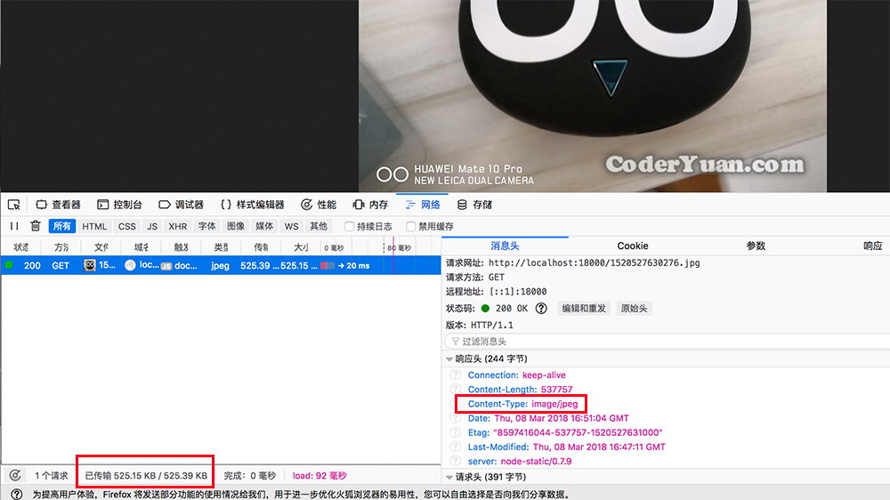

# coderyuan-image-server

A simple image server by using Node.js!

## Requirements:

**OS**: Linux or macOS, not support Windows.

**WebP**: 

Download WebP sources from [Google Developers](https://developers.google.com/speed/webp/) or Install by brew or yum.

    brew install webp          # macOS
    sudo yum install libwebp   # CentOS

If you get the information below then your webp has been installed:

```bash
cwebp
Usage:

   cwebp [options] -q quality input.png -o output.webp

where quality is between 0 (poor) to 100 (very good).
Typical value is around 80.

Try -longhelp for an exhaustive list of advanced options.
```

**GraphicsMagick** or **ImageMagick**:

Download and install [GraphicsMagick](http://www.graphicsmagick.org/) or [ImageMagick](http://www.imagemagick.org/). In Mac OS X, you can simply use [Homebrew](http://mxcl.github.io/homebrew/) and do:

    brew install imagemagick
    brew install graphicsmagick

If you want WebP support with ImageMagick, you must add the WebP option:

    brew install imagemagick --with-webp

On CentOS:
   
    sudo yum install GraphicsMagick
    sudo yum install ImageMagick

## Features:

### Image Trasmit Service:

Parsing HTTP request's headers, according to **Accepts**, response a PNG/JPG/GIF image or WebP image (if file existed) automaticly.

#### Chrome:


#### Firefox:




### Image Upload Service:

The server provides a HTTP API to POST an image file with AccessToken. At the same, you can set whether or not attaching a watermark and converting to WebP format.

All the configs in the **[config.yml](config.yml)**

If you don't want to create a page to upload, you can use **cURL**, like: 
```bash
curl -F "image=@IMG_20171122_212957.jpg" http://localhost:18001/?accessToken=000&nomark=0   # nomark=1 if you don't want to attach water mark.
```
After uploading, server will response:
````json
{
    "status":0,
    "data":
    {
        "url":"http://localhost:18000/1520529341826.jpg"
    }
}
````
Field **URL** means the full URL for fetching image.


## Run:

#### 1. Clone

```bash
git clone https://github.com/yuanguozheng/coderyuan-image-server && cd coderyuan-image-server
```

#### 2. Install Dependencies

Use ```yarn``` or ```npm install```

#### 3. Start

```npm start```


If the server has been launched normally, the terminal will get:

```
[2018-03-09 00:47:01.046] - INFO	  Resolver service has been started, port: 18000
[2018-03-09 00:47:01.050] - INFO	  Uploader service has been started, port: 18001
```